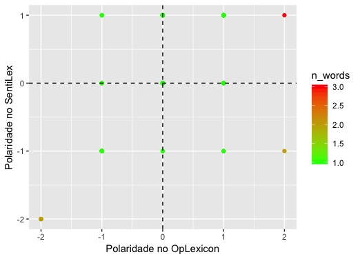

# Analise de Texto usando R e Orange3 (Python)

## Analise dos programas de governo presidenciais

## 1. Obtendo os dados
Antes de tudo, como uma boa analise de dados, devemos obter os dados para tal. Como os programas de governo dos candidatos ja esta em forma de texto o nosso trabalho diminui.
### Fonte de dados dos programas de Governo dos candidatos
Fui atras dos programas de governo dos candidatos direto no site do TSE para termos uma fonte de dados confiavel e assertiva e achei o PDF dos dois - Haddad e Bolsonaro. Ambos com mais de 80 paginas :O
Bolsonaro - http://divulgacandcontas.tse.jus.br/candidaturas/oficial/2018/BR/BR/2022802018/280000614517/proposta_1534284632231.pdf
Haddad - http://divulgacandcontas.tse.jus.br/candidaturas/oficial/2018/BR/BR/2022802018/280000629808/proposta_1536702143353.pdf 

Copiei o texto dos dois programas, colei no Sublime Text e gerei um txt de cada, sem fazer nenhum tratamento no texto. ( talvez terei problemas com isso no futuro haha, tem bastante caractere especial e bullet point)

## 2. Ferramentas

Neste caso uso o R para tratamento dos dados e analise de sentimento e o Orange 3 (python) para word cloud, classification, pre-processamento e talvez uma analise de sentimento.

## Orange 3
No Orange 3 eu usei o add-on chamado Text Mining com excelentes ferramentas de analise de texto.
### Importing Documents
Fiz a importacao dos arquivos de texto dos dois candidatos. 
### Corpus Viwer
Fiz a leitura dos arquivos.
### Pre-processing
Precisamos tratar estes documentos.
1. Transformei em lower case, tirei os html, Regexp \w+ , Stopwords Portugues, Regexp de pontuacao 
2. Usei este site https://textmechanic.com/text-tools/numeration-tools/generate-list-numbers/ para criar uma lista de numeros de 1 a 1000000, pois os documentos tem muitos numeros, e nao quero eles. Coloquei a lista no filtering

### Word Cloud 
Haddad
Bolsonaro
Ambos

### Prediction Model

## Analise de Sentimento - R com Lexicon PT e tidytext
Importando as dependencias.
```
library(tidyverse) 
library(ggExtra)
library(magrittr) 
library(lubridate)
library(stringr) # trabalhar com textos
library(tidytext) # text mining
library(lexiconPT)
```
Importando os documentos.
```
bolsonaro <- read.delim("~/Desktop/IA/Text/Politica/2018/Bolsonaro/bolsonaro.txt", header=FALSE)
View(bolsonaro)
haddad <- read.delim("~/Desktop/IA/Text/Politica/2018/Haddad/haddad.txt", header=FALSE)
View(haddad)
```
Carregando os datasets.
```
# carregar datasets
data("oplexicon_v3.0")
data("sentiLex_lem_PT02")

op30 <- oplexicon_v3.0
sent <- sentiLex_lem_PT02

glimpse(op30)
```
Resultado
```
Observations: 32,191
Variables: 4
$ term              <chr> "=[", "=@", "=p", "=P", "=x", "=d", "=D", ";)", ...
$ type              <chr> "emot", "emot", "emot", "emot", "emot", "emot", ...
$ polarity          <int> -1, -1, -1, -1, -1, 1, 1, 1, 1, -1, -1, -1, -1, ...
$ polarity_revision <chr> "A", "A", "A", "A", "A", "A", "A", "A", "A", "A"...
```
Removendo os NAs caso tenham.
```
# remover NAs 
bolsonaro <- bolsonaro %>% filter(!is.na(bolsonaro$V1))
haddad <- haddad %>% filter(!is.na(haddad$V1))
```
Criar uma ID unica para cada frase que foi previamente separada por Tab.
```
# criar ID unica para cada comentario
bolsonaro <- bolsonaro %>% mutate(col_id = row_number())
haddad <- haddad %>% mutate(col_id = row_number())
```
Converter a coluna de factor para char vector pois tidytext somente lê char na funcao.
```
#converter de factor para char vector
bolsonaro$V1 <- as.character(bolsonaro$V1)
haddad$V1 <- as.character(haddad$V1)
```
Usar a funcao do tidytext para converter os textos em palavras separadas
```
# usar funçao do tidytext para criar uma linha para cada palavra de um comentario
bolsonaro_unnested <- bolsonaro %>% unnest_tokens(term,V1)
haddad_unnested <- haddad %>% unnest_tokens(term,V1)
```
Visualize o resultado se quiser.
```
# visualizar o resultado
bolsonaro_unnested %>%
  select(col_id, term) %>%
  head(20)
haddad_unnested %>%
  select(col_id, term) %>%
  head(20)
 
 ```
 Resultado
 ```
    col_id           term
1        1  bolsonaro2018
2        2         brasil
2.1      2          acima
2.2      2             de
2.3      2           tudo
3        3           deus
3.1      3          acima
3.2      3             de
3.3      3          todos
4        4              o
4.1      4        caminho
4.2      4             da
4.3      4   prosperidade
5        5       proposta
5.1      5             de
5.2      5          plano
5.3      5             de
5.4      5        governo
6        6 constitucional
7        7      eficiente
```
Quantificar o sentimento das frases usando os dois data sets e fazendo um left_join com as palavras que possuem sentimento registradas no data set. Para mim elas sao limitadas e tambem podem ser aprimoradas e ampliadas. Isso é um trabalho para o futuro.
 
 ```
 #quantificar o sentimento das frases
bolsonaro_unnested %>% 
  left_join(op30, by = "term") %>% 
  left_join(sent %>% select(term, lex_polarity = polarity), by = "term") %>% 
  select(col_id, term, polarity, lex_polarity) %>% 
  head(10)
haddad_unnested %>% 
  left_join(op30, by = "term") %>% 
  left_join(sent %>% select(term, lex_polarity = polarity), by = "term") %>% 
  select(col_id, term, polarity, lex_polarity) %>% 
  head(10)
```
Resultado
```
   col_id          term polarity lex_polarity
1       1 bolsonaro2018       NA           NA
2       2        brasil       NA           NA
3       2         acima       NA           NA
4       2            de       NA           NA
5       2          tudo       NA           NA
6       3          deus       NA           NA
7       3         acima       NA           NA
8       3            de       NA           NA
9       3         todos       NA           NA
10      4             o       NA           NA
```

Para fazer um melhor proveito dos dois datasets vamos fazer um inner_join para manter apenas as palavras que tem um sentimento presente nas duas. Iremos perder algumas palavras, mas é somente para nao termos que gerar graficos para cada tipo de dataset, o que tambem pode ser feito. 

```
#manter apenas as que tem polaridade nas duas livrarias
bolsonaro_unnested <- bolsonaro_unnested %>% 
  inner_join(op30, by = "term") %>% 
  inner_join(sent %>% select(term, lex_polarity = polarity), by = "term") %>% 
  group_by(col_id) %>% 
  summarise(
    comment_sentiment_op = sum(polarity),
    comment_sentiment_lex = sum(lex_polarity),
    n_words = n()
  ) %>% 
  ungroup() %>% 
  rowwise() %>% 
  mutate(
    most_neg = min(comment_sentiment_lex, comment_sentiment_op),
    most_pos = max(comment_sentiment_lex, comment_sentiment_op)
  )

haddad_unnested <- haddad_unnested %>% 
  inner_join(op30, by = "term") %>% 
  inner_join(sent %>% select(term, lex_polarity = polarity), by = "term") %>% 
  group_by(col_id) %>% 
  summarise(
    comment_sentiment_op = sum(polarity),
    comment_sentiment_lex = sum(lex_polarity),
    n_words = n()
  ) %>% 
  ungroup() %>% 
  rowwise() %>% 
  mutate(
    most_neg = min(comment_sentiment_lex, comment_sentiment_op),
    most_pos = max(comment_sentiment_lex, comment_sentiment_op)
  )

head(bolsonaro_unnested)


```
Resultado
```
# A tibble: 6 x 6
  col_id comment_sentiment_op comment_sentiment_lex n_words most_neg most_pos
   <int>                <int>                 <dbl>   <int>    <dbl>    <dbl>
1      7                    1                     1       1        1        1
2      8                    1                     1       1        1        1
3     14                    0                     1       1        0        1
4     15                    1                     1       2        1        1
5     22                    1                     1       1        1        1
6     32                    1                     1       1        1        1
```

Plotar os dados para verificar a polaridade dos datasets nos programas de governo.

```
g <- bolsonaro_unnested %>% 
  ggplot(aes(x = comment_sentiment_op, y = comment_sentiment_lex)) +
  geom_point(aes(color = n_words)) + 
  scale_color_continuous(low = "green", high = "red") +
  labs(x = "Polaridade no OpLexicon", y = "Polaridade no SentiLex") +
  #geom_smooth(method = "lm") +
  geom_vline(xintercept = 0, linetype = "dashed") +
  geom_hline(yintercept = 0, linetype = "dashed")

g

p <- haddad_unnested %>% 
  ggplot(aes(x = comment_sentiment_op, y = comment_sentiment_lex)) +
  geom_point(aes(color = n_words)) + 
  scale_color_continuous(low = "green", high = "red") +
  labs(x = "Polaridade no OpLexicon", y = "Polaridade no SentiLex") +
  #geom_smooth(method = "lm") +
  geom_vline(xintercept = 0, linetype = "dashed") +
  geom_hline(yintercept = 0, linetype = "dashed")

p
```
### Polaridade Bolsonaro (grafico)
Apresenta pontos bastante polarizado com pontos bem distantes de distribuidos.
### Polaridade Haddad (grafico)
Apresenta pontos menos polarizados e tendendo ao centro do grafico com apenas um "outlier" bastante positivo.

### Positividade e Negatividade das propostas
Filtrar os dados entre -10 e 10.
```
#detectar frases mais positivas e mais negativas
bolsonaro_unnested %<>% filter(between(comment_sentiment_op, -10, 10))
haddad_unnested %<>% filter(between(comment_sentiment_op, -10, 10))
```
Detectar o comentario mais positivo e mais negativo de cada candidato.
```
# comentario mais positivo e mais negativo da campanha
most_posB <- which.max(bolsonaro_unnested$most_pos)
most_negB <- which.min(bolsonaro_unnested$most_neg)
most_posH <- which.max(bolsonaro_unnested$most_pos)
most_negH <- which.min(bolsonaro_unnested$most_neg)
```

### Bolsonaro
```
# mais positivo e negativo Bolsonaro
cat(bolsonaro$V1[bolsonaro$col_id == bolsonaro_unnested$col_id[most_posB]])
cat(bolsonaro$V1[bolsonaro$col_id == bolsonaro_unnested$col_id[most_negB]])
```
Positivo - "DEUS ACIMA DE TODOS PREVENIR É MELHOR E MAIS BARATO"
Negativo - "deveres (não matar, não roubar, não participar de falso testemunho, não sonegar impostos, etc.)."

### Haddad
```
# mais positivo e negativo Haddad
cat(haddad$V1[haddad$col_id == haddad_unnested$col_id[most_posH]])
cat(haddad$V1[haddad$col_id == haddad_unnested$col_id[most_negH]])
```
Positivo - "programa, em especial em áreas metropolitanas, na construção de territórios includentes, seguros, resilientes"
Negativo - "constrói o seu caminho para a democracia, desenvolvimento e a justiça social, ou afundará no rumo imposto"


## Agora vamos fazer uma analise no texto por inteiro
Usando somente o OPLexicom para analisar o sentimento dos textos.
```
#usar somente o OPLexicon para analise de sentimento de acordo com o texto inteiro
bolsonaro %<>% inner_join(
  bolsonaro_unnested %>% select(col_id, sentiment = comment_sentiment_op),
  by = "col_id"
)
haddad %<>% inner_join(
  haddad_unnested %>% select(col_id, sentiment = comment_sentiment_op),
  by = "col_id"
)
```
Criar um dataset wide para agrupar os sentimento somente positivos e negativos do texto inteiro.

```
bolsonaro_wide <- bolsonaro %>% 
  # filtrar fora palavras neutras
  filter(sentiment != 0) %>% 
  # converter numerico para categorico
  mutate(sentiment = ifelse(sentiment < 0, "negativo", "positivo")) %>% 
  # agrupar os dados
  count(col_id, sentiment) %>% 
  # converter para formato wide
  spread(sentiment, n, fill = 0) %>% 
  mutate(sentimento = positivo - negativo) %>% 
  ungroup() %>% 
  arrange(col_id)

head(bolsonaro_wide) %>% knitr::kable()
```
Resultado
```
| col_id| negativo| positivo| sentimento|
|------:|--------:|--------:|----------:|
|      7|        0|        1|          1|
|      8|        0|        1|          1|
|     15|        0|        1|          1|
|     22|        0|        1|          1|
|     32|        0|        1|          1|
|     46|        1|        0|         -1|
```

Agora que fica interessante, iremos plotar um grafico com os sentimentos de ambos no decorrer da proposta.
Bolsonaro:
```
#plotar um grafico com os sentimentos de ambos no texto
bolsonaro_wide %>% 
  mutate(index = row_number()) %>% 
  ggplot(aes(x = index, y = sentimento)) +
  geom_col(aes(fill = col_id)) +
  scale_y_continuous(breaks = seq(-2, 2, 1), limits = c(-2, 2)) +
  labs(x = "Índice da Frases", y = "Sentimento",
       fill = NULL, title = "Evolução do sentimento no programa Bolsonaro")
```
(Grafico)
Haddad:
```
haddad_wide %>% 
  mutate(index = row_number()) %>% 
  ggplot(aes(x = index, y = sentimento)) +
  geom_col(aes(fill = col_id)) +
  scale_y_continuous(breaks = seq(-2, 2, 1), limits = c(-2, 2)) +
  labs(x = "Índice da Frases", y = "Sentimento",
       fill = NULL, title = "Evolução do sentimento no programa Haddad")
```
(Grafico)


Vamos ver a soma dos sentimentos e ver qual prevalece. Veremos os comentarios positivos, negativos e o sentimento. O sentimento sera a soma dos dois, logo quanto maior o sentimento melhor. Para remover qualquer bias, analisaremos em porcentagem do total.
```
#somar os sentimentos gerais dos dois programas
bolsoTot <- bolsonaro_wide %>% summarise_all(funs(sum))
hadTot <- haddad_wide %>% summarise_all(funs(sum))
```
Bolsonaro:
Negativo - 30 - 36.6%
Positivo - 52 - 63.41%
Total - 82 - 100%
Sentimento - 22 - 26.8%

Haddad:
Negativo - 50 - 19.84%
Positivo - 202 - 80.16%
Total - 252 - 100%
Sentimento - 152 - 60.3%

(grafico)

### Sentimento por topicos
Para finalizar iremos analisar o sentimento dos canditados relacionados a topicos distintos.
Usaremos os topicos: 
- Emprego
- Salário
- Bolsa Família
- Família
- PEC 95
- Gastos
- Brasil
- Impostos
- Diversidade
- Imprensa
- LGBT
- Lava Jato
- Aborto
- Corrupção
- Policia
- Cadeia
- Imposto de renda
- saúde 
- educação
- segurança
- economia

Bolsonaro:
```
# qual o sentimento mais associado a palavras em especifico
bolsonaro %>% 
  mutate(
    emprego = str_detect(str_to_lower(V1), "emprego"),
    salario = str_detect(str_to_lower(V1), "salário"),
    bolsa_familia = str_detect(str_to_lower(V1), "bolsa família"),
    familia = str_detect(str_to_lower(V1), "família"),
    pec95 = str_detect(str_to_lower(V1), "pec 95"),
    gastos = str_detect(str_to_lower(V1), "gastos"),
    brasil = str_detect(str_to_lower(V1), "brasil"),
    impostos = str_detect(str_to_lower(V1), "impostos"),
    diversidade = str_detect(str_to_lower(V1), "diversidade"),
    imprensa = str_detect(str_to_lower(V1), "imprensa"),
    lgbt = str_detect(str_to_lower(V1), "lgbt"),
    lavajato = str_detect(str_to_lower(V1), "lava jato"),
    aborto = str_detect(str_to_lower(V1), "aborto"),
    corrupcao = str_detect(str_to_lower(V1), "corrupção"),
    policia = str_detect(str_to_lower(V1), "policia"),
    cadeia = str_detect(str_to_lower(V1), "cadeia"),
    ir = str_detect(str_to_lower(V1), "imposto de renda"),
    saude= str_detect(str_to_lower(V1), "saúde"),
    educacao = str_detect(str_to_lower(V1), "educação"),
    economia = str_detect(str_to_lower(V1), "economia")
  ) %>% 
  gather(termo, eh_presente, emprego:economia) %>% 
  filter(eh_presente) %>% 
  group_by(termo) %>% 
  summarise(sentiment = mean(sentiment)) %>% 
  ggplot(aes(x = termo, y = sentiment)) + 
  geom_col(fill = "#C10534")
```
(grafico)

Haddad:
```
haddad %>% 
  mutate(
    emprego = str_detect(str_to_lower(V1), "emprego"),
    salario = str_detect(str_to_lower(V1), "salário"),
    bolsa_familia = str_detect(str_to_lower(V1), "bolsa família"),
    familia = str_detect(str_to_lower(V1), "família"),
    pec95 = str_detect(str_to_lower(V1), "pec 95"),
    gastos = str_detect(str_to_lower(V1), "gastos"),
    brasil = str_detect(str_to_lower(V1), "brasil"),
    impostos = str_detect(str_to_lower(V1), "impostos"),
    diversidade = str_detect(str_to_lower(V1), "diversidade"),
    imprensa = str_detect(str_to_lower(V1), "imprensa"),
    lgbt = str_detect(str_to_lower(V1), "lgbt"),
    lavajato = str_detect(str_to_lower(V1), "lava jato"),
    aborto = str_detect(str_to_lower(V1), "aborto"),
    corrupcao = str_detect(str_to_lower(V1), "corrupção"),
    policia = str_detect(str_to_lower(V1), "policia"),
    cadeia = str_detect(str_to_lower(V1), "cadeia"),
    ir = str_detect(str_to_lower(V1), "imposto de renda"),
    saude= str_detect(str_to_lower(V1), "saúde"),
    educacao = str_detect(str_to_lower(V1), "educação"),
    economia = str_detect(str_to_lower(V1), "economia")
  ) %>% 
  gather(termo, eh_presente, emprego:economia) %>% 
  filter(eh_presente) %>% 
  group_by(termo) %>% 
  summarise(sentiment = mean(sentiment)) %>% 
  ggplot(aes(x = termo, y = sentiment)) + 
  geom_col(fill = "#C10534")
```

(grafico)


## Welcome to GitHub Pages

You can use the [editor on GitHub](https://github.com/octaviobomfim/TextAnalysis/edit/master/README.md) to maintain and preview the content for your website in Markdown files.

Whenever you commit to this repository, GitHub Pages will run [Jekyll](https://jekyllrb.com/) to rebuild the pages in your site, from the content in your Markdown files.

### Markdown

Markdown is a lightweight and easy-to-use syntax for styling your writing. It includes conventions for

```markdown
Syntax highlighted code block

# Header 1
## Header 2
### Header 3

- Bulleted
- List

1. Numbered
2. List

**Bold** and _Italic_ and `Code` text

[Link](url) and 
```

For more details see [GitHub Flavored Markdown](https://guides.github.com/features/mastering-markdown/).

### Jekyll Themes

Your Pages site will use the layout and styles from the Jekyll theme you have selected in your [repository settings](https://github.com/octaviobomfim/TextAnalysis/settings). The name of this theme is saved in the Jekyll `_config.yml` configuration file.

### Support or Contact

Having trouble with Pages? Check out our [documentation](https://help.github.com/categories/github-pages-basics/) or [contact support](https://github.com/contact) and we’ll help you sort it out.
